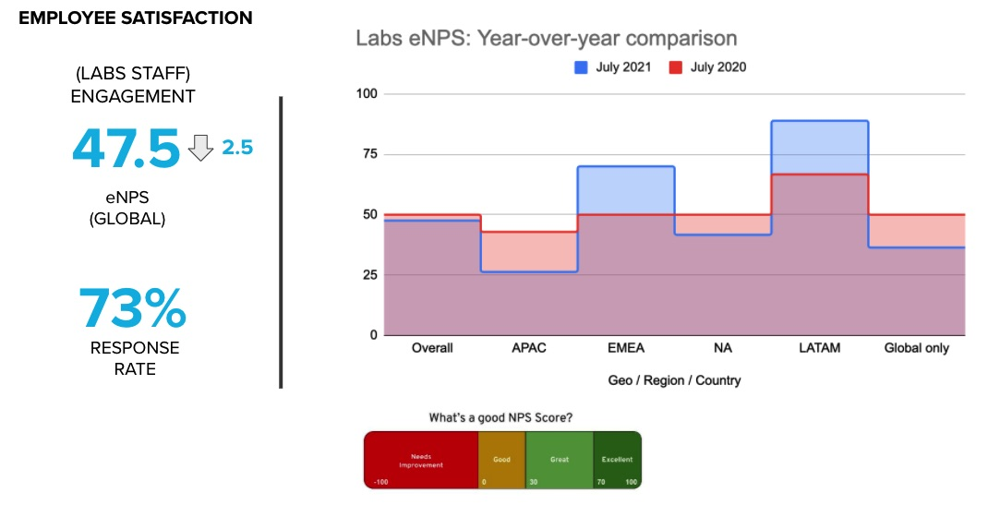
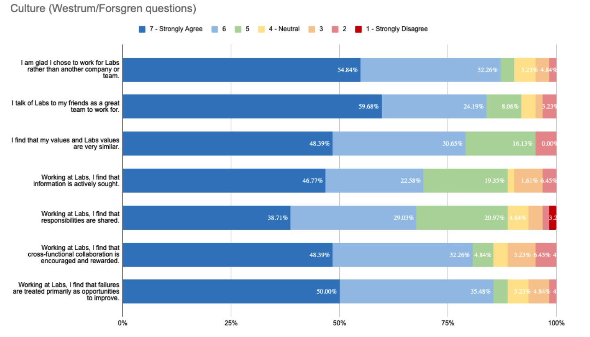
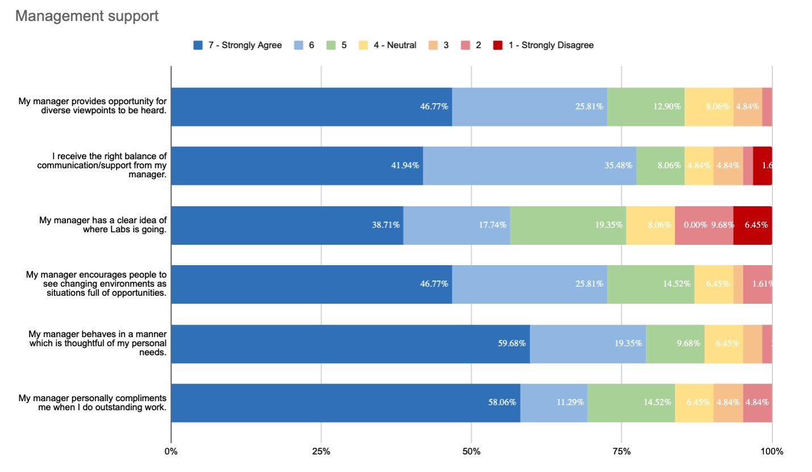

Employee Satisfaction
===============

**Labs Strategic Pillar #1: By committing to a continuous pursuit of job satisfaction for our staff, we'll maintain a healthy organization capable of executing our mission.**

Why is this important?
--------------------------

Employee satisfaction is the first pillar of our strategic framework at Open Innovation Labs -- if we're not happy with our jobs, how can we execute on our mission to create an amazing Labs experience for our clients? 

Also, since we tend to take risks and do new things at Labs, there's a greater chance that employee satisfaction might change frequently. 

So, we've committed to measuring the team's levels of job satisfaction -- in a variety of ways -- in order to identify opportunuties for improvement, and more importantly -- to take actions that result in job satisfaction improvements.

Who owns this?
--------------

It is the *regional practice lead* who is accountable for maintaining and continuously improving employee satisfaction in their region. The *global practice lead* is accountable for making it easy to gather and share employee satisfaction information in a globally consistent and meaningful way. 

What does our current employee satisfaction look like?
------------------------------------------

Survey Summary
--------------
* Our last global survey was run on: July 2021
* Our 'Employee Net Promoter Score' (eNPS): *47.5* 
* Our response rate: 73% of staff
* eNPS trend: down 2.5 points, year-over-year

Survey eNPS
-----------
The employee net promoter score (eNPS) is based on the question:
> (On a scale of 0-10) How likely is it that you would recommend the Open Innovation Labs as a good place to work to a friend or colleague?

Survey Details
-------------------

[interactive version](https://docs.google.com/spreadsheets/d/e/2PACX-1vTenX00Cf3_ZU5i2CEJjRfTFbHPQGaU3Y3GzR-yI0y3z1zPvcaH6UA7Lq6kK3P7y7P9BPYeKYufw9cg/pubchart?oid=1624428586&format=interactive)

[interactive version](https://docs.google.com/spreadsheets/d/e/2PACX-1vTenX00Cf3_ZU5i2CEJjRfTFbHPQGaU3Y3GzR-yI0y3z1zPvcaH6UA7Lq6kK3P7y7P9BPYeKYufw9cg/pubchart?oid=42700771&format=interactive)

Other Measures
--------------
We also use tools like cognitive-load-o-meter, mood marbles, fist-of-five, and other techniques to gather more real-time data related to job satsifaction, usually done among members of smaller teams.

<!-- TODO: Share global and regional action plan summaries here? -->

Sources of inspiration
----------------------
Our pursuit of employee satisfaction is inspired by many sources, notably including:
* [Drive, The Surprising Truth About What Motivates Us, by Daniel Pink](https://www.danpink.com/books/drive/)
* [Henrik Kniberg's blog and video on Spotify Engineering Culture](https://youtu.be/Yvfz4HGtoPc?t=401)
* [Slack: Getting Past Burnout, Busywork, and the Myth of Total Efficiency, by Tom DeMarco](https://www.amazon.com/Slack-Getting-Burnout-Busywork-Efficiency/dp/0767907698) 