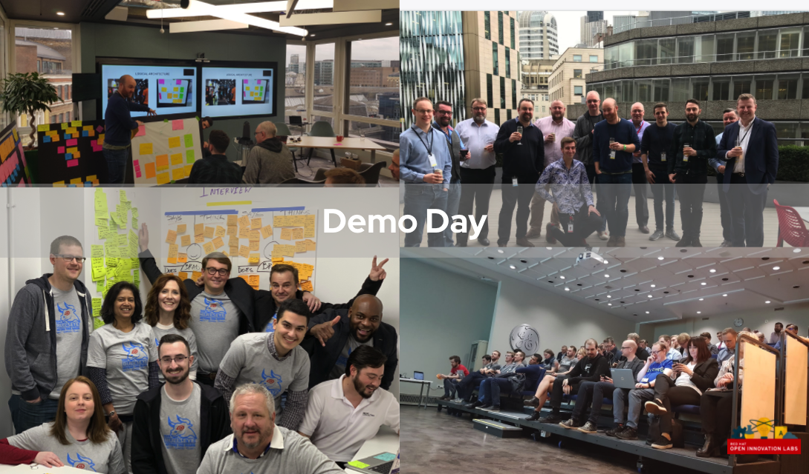

# How we differentiate

Red Hat has always been a bit different. We’re an enterprise software company, but one with an open-source development model. This simple statement has had profound implications to:
- the way we develop and deliver software
- the way we collaborate with our clients, partners, and communities, and perhaps most importantly,
- the set of principles and customs that make up Red Hat’s cultural “DNA”.

Open Innovation Labs started with a challenge: customers at our Strategic Advisory Board meeting in 2015 asked Red Hat to “open its doors” and allow them to see an experience how Red Hat builds software, in order to help them do the same. We wondered: if we could open the doors to our clients, partners and communities to co-create digital products with us, what kind of outcomes could we accomplish? What kind of experience could we create?

Our foundations, and these basic questions, have resulted in  an Open Innovation Labs that is rather different.

# Why we’re different

  - [1. Open by Design](#1-open-by-design)
  - [2. We help organizations extract maximum value from the hybrid cloud](#2-we-help-organizations-extract-maximum-value-from-the-hybrid-cloud)
  - [3. 100% Dedicated to Making Our Clients Independently Successful](#3-100-dedicated-to-making-our-clients-independently-successful)

## 1. Open by design

At Open Innovation Labs, we’ve open sourced Red Hat’s DNA. We welcome visitors to join us, to work together with us  to co-create an innovative digital solution, and experience the power of open-source code and culture. 

<!-- TODO: Eventually these should link to pages with multiple links for each item below -->
To maximize this experience, we’ve deliberately open sourced everything, including our:
- [Our code](https://github.com/rht-labs)
- [Our practices](https://openpracticelibrary.com/)
- Our products
- [Our training material](https://rht-labs.com/tech-exercise/#/)
- [Our principles](https://rht-labs.com/docs/labs-principles.html)
- [Our leadership and organizational philosophy](http://theopenorganization.org/)
- [Our management tooling](https://github.com/rht-labs/lodestar-frontend)
- [Our inner workings](https://rht-labs.com/docs/index.html)
- and [as much of our culture as we can](https://www.amazon.com/DevOps-Culture-Practice-OpenShift-continuous/dp/1800202369/). 

<!-- TODO:  We wrote the book on Open Leadership and the Open Organisation. -->

The transparency of working in the open keeps us honest and authentic about what we do (this site is one such example!). 

We believe that this transparency is an essential part of our competitive advantage; we are unafraid to radically share everything we use, with the goal of helping our customers leverage our open-source assets and enable them to independently accelerate their time-to-value in ways that can only be achieved through this open-source model.

Everything you experience at Labs – the software products, the infrastructure-as-code and automation codebases, the training, the practices, the principles, and the inner workings of our business – is yours for the taking. After completing a residency, we continue to engage with our clients in our open source communities, to extend and maximize the advantages of working together in this fashion.

<!-- TODO: We could have something here about.... when that isn't possible we foster understanding of how to establish inner sourcing models so customers can unleash the potential of their workforce, remove bottlenecks, and minimize the impact of biases and silos through greater inclusivity.
-->

## 2. We help organizations extract maximum value from the hybrid cloud

Put simply: if you want to build great, cloud-native software products, come and work with the company that built the open hybrid cloud.

Working with Red Hat provides the opportunity to work with the people who:
Shaped the path of kubernetes, as the #1 code contributor to k8s beyond Google and leader of key engineering efforts
Operates hybrid clouds at global scale for more than half a decade
Built a customer success organization focused on helping customers build cloud-native software products

We help organizations extract maximum value from the cloud.

<!-- TODO:  Could stop here, or later… 

Want to know how Red Hat Site Reliability Engineering maintains reliable hybrid clouds at global scale, while maintaining a high rate of change velocity?

Collaborating with Open Innovation Labs provides our customers the opportunity to work with our Labs Site Reliability Engineering team (SRE). Our SREs are responsible for maintaining the reliability and change velocity of global labs hosting infrastructure. Our team leverages learnings, tools and techniques from our broader team of site reliability engineers at Red Hat, who have operated multi-tenant, hybrid clouds at global scale for more than half a decade. And our experience is not limited to just one public cloud platform; we’ve been managing these environments in ALL the major public clouds, as well as many varieties of private cloud infrastructures.

// TODO…could stop here.

We made a deliberate choice to focus on solving Open Hybrid Cloud computing challenges from the very beginning of Open Innovation Labs. Solving cloud computing challenges are the “table stakes” requirement for every engagement we perform. 

This deliberate choice means that we may lack expertise in some niche area not relevant to cloud computing. When that’s the case, we’ll partner or provide you with recommendations of other firms to work with when that’s what you really need! Our strategic focus has allowed us to develop what we believe are the strongest capabilities and deepest subject matter expertise on hybrid cloud computing in the industry.

// TODO: or could just stop here.
--->

## 3. 100% dedicated to making our clients independently successful

Red Hat Open Innovation Labs works with our clients to help them establish long lived, cross functional product teams capable of delivering sustained competitive advantage to their own organization. 
Our purpose is to enable customer independence, unlike traditional models which focus on creating dependence on long term services engagements or outsourcing deals. In short, we focus on enabling organizations to establish or enhance their own in-house capability and attract industry top talent. 

For example, residency engagements are focused on delivering outcomes that matter. Upon leaving the residency, the team will have lived in the conditions and experienced the practices of high performing teams, they will have a working software product that satisfies the needs of the business and it’s customers, they will understand how to squeeze the value out of the platform, and they will have the stories necessary to inspire and accelerate change from the bottom up and top down.

The experience culminates in ‘Demo Day’ (see above) where the team get to share their story; a story where they are the heroes and the Labs team are part of the audience.

<!--
// TODO: <Could finish here?>
Residency engagements are focused on your target outcomes, not product features. Upon leaving the residency, the team will have lived in the conditions and experienced the practices of high performing teams, they will have a working software product that satisfies the needs of the business and it’s customers, they will understand how to squeeze the value out of the platform, and they will have the stories necessary to inspire and accelerate change from the bottom up and top down.
[Insert link on how our clients leverage from our shared experience]
The experience culminates in ‘Demo day’ where the team get to share their story; a story where they are the heroes and the Labs team are part of the audience.
--->
