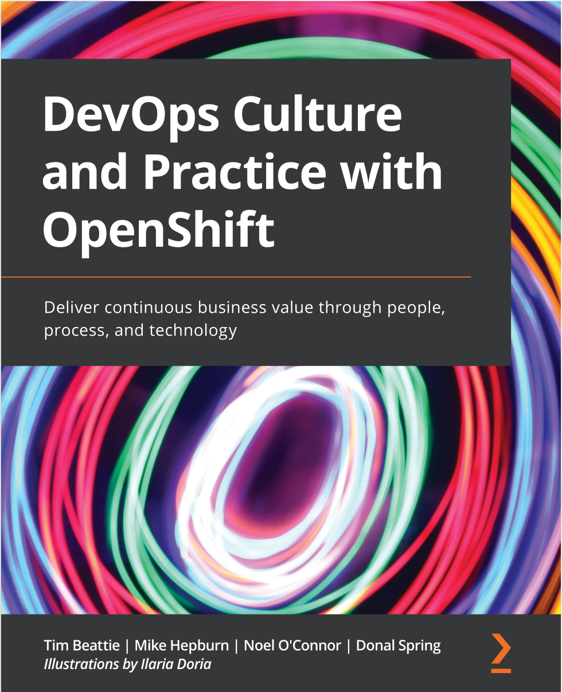

Practice Makes Perfect
======================

> Applying a DevOps model can help you deliver innovative applications with speed and agility. It really is all about collaboration across teams. However, many organizations don’t know how to get started.
 
In this session of Red Hat’s developer corner, you’ll have the opportunity to connect with one of the authors of the book, `DevOps Culture and Practice with OpenShift: Deliver continuous business value through people, processes, and technology.` He’ll help you increase your understanding of DevOps, collaboration, and cultural and engineering practices on a container platform such as Red Hat OpenShift. You’ll learn how to make moving to DevOps easier and develop a clearer path for beginning your journey.

Checkout the presentation, video and resources here: [Red Hat's developer corner - Session 4: DevOps with OpenSift - Practice makes perfect](https://tracks.redhat.com/l/cy_21_q3_na_cn_devel).

📽️ _Click the image to watch the video_ 📽️

