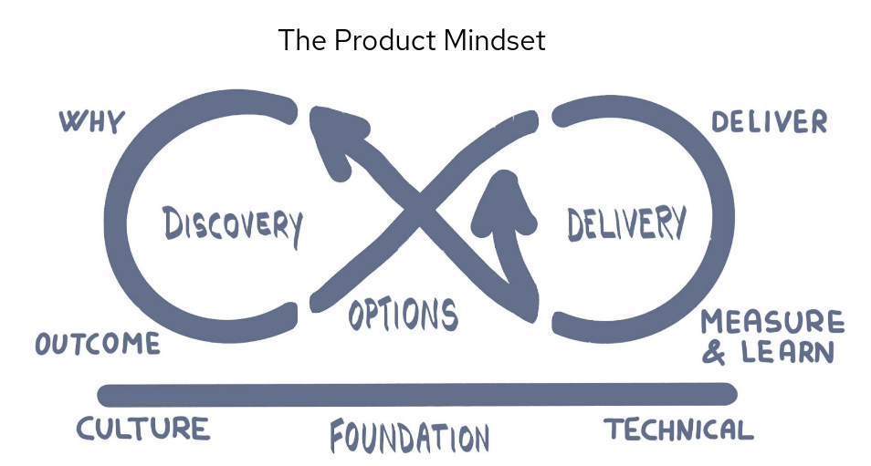

The Product Mindset
===================

> To build high performing teams, it helps if your organisation can adopt a long lived product mindset. At Red Hat Open Innovation Labs - we are a services organisation that has adopted a product mindset !

Adopting a Product Mindset
--------------------------

We encourage customer organisations to build long lived teams that are aligned to a single product or value stream. Often we see teams being brought together for individual projects and then torn apart at the end of that project. This is one of the problems of organising around projects as the structure of work - they are by definition short lived exercises.

Products have a much longer lifecycle than a project. The textbook definition of a product lifecycle looks like this:

During the early introduction and growth phases, products are `Crossing the Chasm` from experimental ideas to having mainstream customers. Many products fail to get past this point in their life! Once you have mainstream customers, there is a long tail where the product matures in the marketplace, and eventually a decline until finally the product is taken off the shelf - or it has been replaced by a better product in the market.

When shifting to a product mindset, team structures must change. It is often necessary to change how these teams are funded as well. We have become heavily inspired by the work of Matthew Skelton and Manuel Pais who wrote the book `Team Topologies`. They introduce different teams with different responsibilities:

- The Enabling Team - who train, coach and guide a team to learn new skills and acquire new practices, much like we do in Red Hat Open Innovation Labs residencies. For us internally this is our Global Labs Team.
- The Stream Aligned Team - a team aligned to a single product or value stream. This is the application team. For us this is the Product Delivery Teams.
- And the Platform Team - who enable stream-aligned teams to deliver work with substantial autonomy. This is our Platform/SRE Team.

We see the Platform as a Product, so in many ways they are a Stream Aligned Team as well - with Developers and Delivery teams as customers.

Within Red Hat Open Innovation Labs we have organised around this model. We have a Platform/SRE team that enables self service capabilities for our regionally aligned product delivery teams. We have a globally distributed enabling team that works to deliver consistent tools and ways of working for across our business.

One of our most important products - is the way we use all of our [practices](https://openpracticelibrary.com/) ourselves to grow a product mentality for our business.

We use these practices to build and enhance our own products, the age old practice of [eating your own dog food](https://en.wikipedia.org/wiki/Eating_your_own_dog_food).

Sources of inspiration
----------------------
* [Team Topologies - Mathew Skelton and Manuel Pais](https://teamtopologies.com/)
* [Mobius Loop - Gabrielle Benefield](http://www.mobiusloop.com/)
* [Product Mindset - The Surprising Secrets of Exceptional Product Leaders - Jessica Hall](https://www.youtube.com/watch?v=V1RiMIM8t0I)