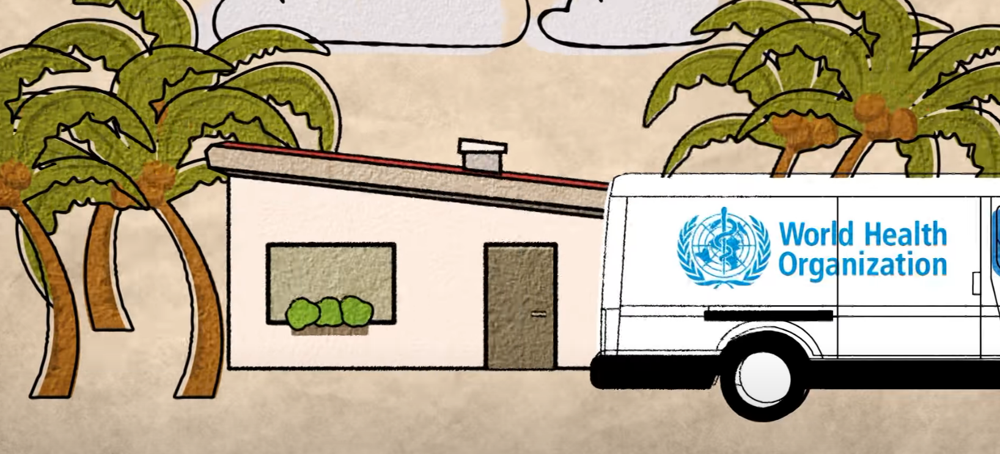

WHO Built This: Why a Learning Platform Can Transform Global Health
======================

> Learn how we worked together with the World Health Organisation to build a working proof of concept learning platform for the world.

A globally dispersed team. Eight weeks. One learning platform that can save lives. This is the story of how a team at the World Health Organization worked with Red Hat Open Innovation Labs to build an idea into a working proof-of-concept.

📽️ _Click the image to watch the video_ 📽️

📖 <a href="https://www.redhat.com/en/success-stories/world-health-organization" target="_blank">_Read more about the case study_</a> 📖
